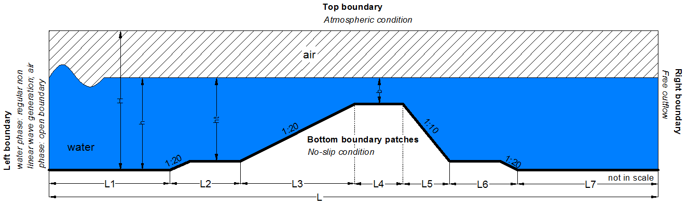

Nonlinear wave shoaling - Dingeman's bar benchmark
=======================

Sea waves transform when propagating from the offshore to the near
shore environment as they interact with coastal structures. In a 2D
flume, the main factors contributing to wave transformation are
shoaling, reflection, transmission and breaking. The present case is
the numerical reproduction of the Dingemans' experiment (Dingemans,
1994), which is a classic benchmark test for numerical models and
refers to non linear shoaling over a submerged shoal.  The
experimental setup is shown the figure below. The geometry represents
a submerged bar with seaward and shoreward slopes of 1/20 and 1/10,
respectively.

The numerical domain of the simulation has a length, L, of
58.0 m. Upstream and downstream the shoal the domain has a height, H,
of 1.26 m, where the mean water depth, h, is equal to 0.86 m. Over the
shoal's crest the water depth, b, is equal to 0.2 m. At the left
boundary regular non linear waves are generated with height of 0.082 m
and period of 1.43 s using Fenton's method (Fenton, 1988). The bottom
boundaries act as a no-slip walls.

where, L1=9.22 m, L2=5.79 m, L3=12.03, L4=4.0 m, L5=6.03 m, L6=8.74
and L7=12.19 m.

This test case demonstrates the ability of PROTEUS to simulate the
shoaling process of regular non linear waves over a submerged shoal as
well as their absorption.

References
----------

- Dingemans M.W. (1994). Comparison of computations with
  Boussinesq-like models and laboratory measurements, Report
  H-1684.12, Delft Hydraulics, 32

- Fenton J.D. (1988). 'The numerical solution of steady water wave
  problems', Comp and Geosc, 14(3), 357-368.

