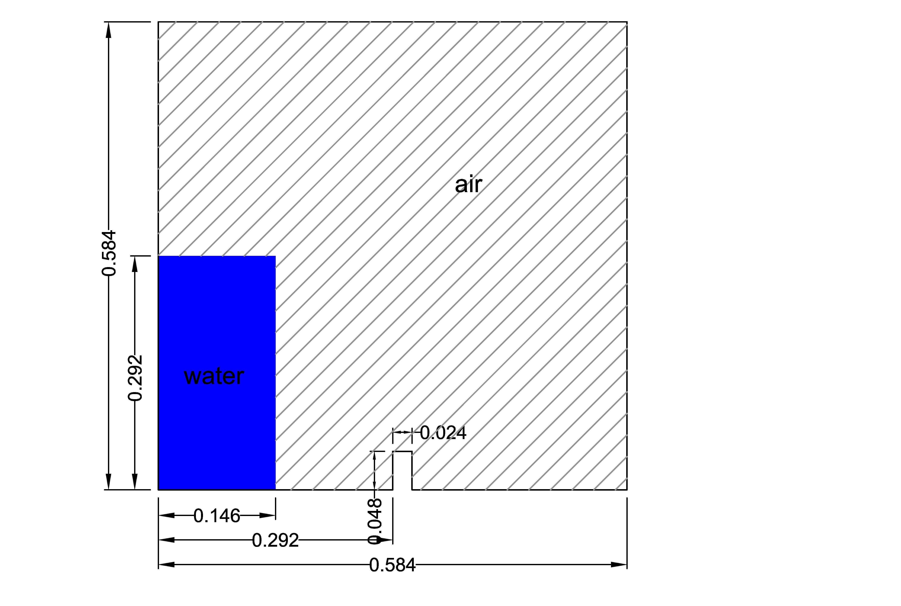

Dambreak flow with obstacle - Ubbink (1997)
===========================================

Description
-----------

The problem comprises a 0.292m x 1.146m (height x width) column of
water in a rectangular container (0.584 m x 0.584 m), initially at rest.  A small obstacle (0.024m x 0.048m) is
placed in the middle of the container's base. The top of the domain is left open, when the rest of
the boundary patches act as free slip walls.  In the following figure, a
sketch of the dambreak initial conditions is shown.

Under the action of gravity the water column collapses and interacts with the obstacle leading 
to a formation of a jet that impacts to a wall.

This case tests the ability of PROTEUS to simulate the free-surface
evolution and during the interaction of the dambreak front with the
obstacle.  The results of the simulations can be visually compared
with screenshots from Ubbink (1997).  For more details, see
runfiles or references.

Tests
-----------

Tests are introduced in the python test file named ``test_dambreak_Ubbink.py`` is made up of 
two tests:

* The first one is to check that the case runs successfully.
* The second test is to assess changes in results by comparing them to reference values. Reference values correspond to average and maximum pressure on a probe located to the obstacle. 

Due to lack of validation data, reference values are set by the numerical results of the first commit of this case. One can run this test file typing ``py.test --boxed test_dambreak_Ubbink.py``.

References
----------

- Ubbink, O. (1997), Numerical prediction of two fluid systems with
  sharp interfaces, PhD thesis, Department of Mechanical Engineering,
  Imperial College of Science, Technology & Medicine
