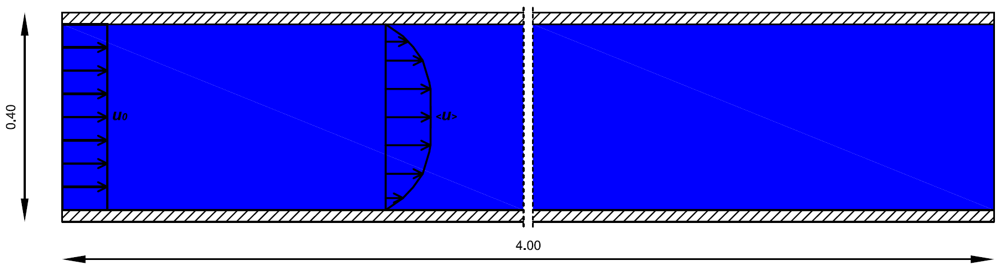

Flat plate turbulent flow – Wall function benchmark
==============================================

Description
-----------
The problem comprises a 0.40m x 4.00m (height x length) tank with smooth plate both at the bottom and the top of the domain.
The water flows through the duct and interacts with the solid wall generating a boundary layer and turbulence in the near-wall region. 



At the close proximity of the wall, in the viscous sub-layer, viscous contribution to the shear stress is significant and in general Reynolds stresses are negligible when compared with it.
Turbulent effects become gradually more important in the inner region moving away from the solid wall. Velocity field assumes a logarithmic profile and the viscous effects can be considered negligible at some point (log-law sublayer).

In CFD models the near-wall sublayer is almost never resolved, as the first discretisation node from the wall typically falls within the inner region where the flow is governed by the logarihtmic law. To account for this simlification, CFD models use a class of boundary conditions commonly refered to as wall functions. These combine dimensional analysis, empirical formulations and input from the model to determin the near wall flow dynamics according tothe logarithmic law.

This case serves as a benchmark for the wall function used in PROTEUS.

For more details on near wall turbulence, see references below.

Running the test case
-----

To run the test case type:

```
parun flat_plate.py--TwoPhaseFlow  -v -D result_folder
```

Dambreak and tank properties can be modified by the commandline, using for example:

```
parun flat_plate.py --TwoPhaseFlow  -v -D result_folder -C "mwl=0.5"
```

To run in parallel (example with mpirun and 12 processors):

```
mpirun -np 12 parun -f flat_plate.py --TwoPhaseFlow  -v -D result_folder -C "mwl=0.5"
```


To see guidance on parun options, you can type  

```
parun -h
```

References
----------

- Pope S.B., Turbulent Flows. Wall flows, 264–298. Reynolds-stress and related models, 442-444.

- Schlichting H., Boundary Layer Theory. Turbulent flow through pipes, 596-623.

