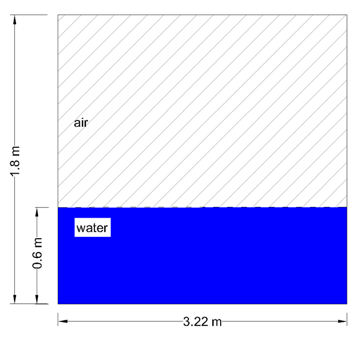

Quiescent water
==================

The computational domain consists of a 2D rectangular box, initialised 
with a quiescent free surface, so that the computational domain includes
both the air and the water phase.  The flow variables (pressure and 
velocities) are not expected to vary in space and time, as the 
simulation progresses in time. The computational domain is a 2D 
rectangular box with dimensions 3.22m x 1.8m and the level of water is 
at 0.6m. The initial conditions of the simulation are shown in the
following figure,

This benchmark was selected to check the stability of PROTEUS and assess
the precision of the “numerical gauge” function.