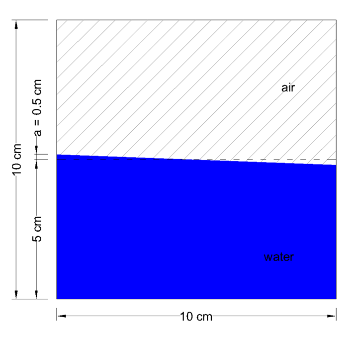

Wave sloshing
==================

Proteus is initialised with a free-surface profile that will excite
the first asymmetric sloshing mode. The free-surface slope is small,
therefore, we can consider that the flow evolution will obey to the
linear sloshing theory. The output of Proteus can be compared with the
analytical solution found in Ibrahim (2005) including only a symmetric
mode. The computational domain is a 2D rectangular box with dimensions
0.1m x 0.1m and the mean level of the water is in the middle of the
box. The initail conditions of the simulation are shown in the
following figure,

where, a is the amplitude of the sloshing wave.

This case tests the ability of PROTEUS to simulate the free-surface
evolution. For more details, see runfiles or references.

References
----------

- Ibrahim RA (2005). Liquid Sloshing Dynamics – Theory and
  Applications, Cambridge University Press, New York, NY.
