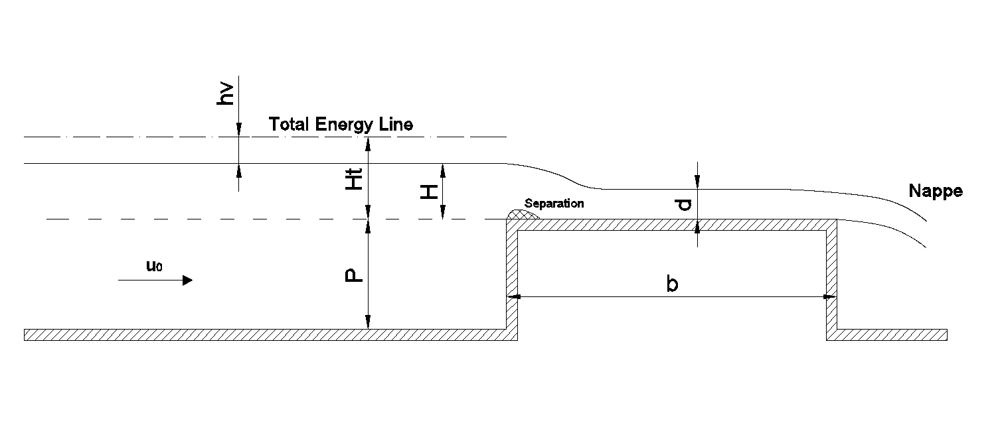

Broad crested weir benchmark case
=================================

A broad-crested weir is a standard hydraulic structure used as discharge measuring
device and flow control device in open channel. This type of weir can be described 
as a simple solid rectangular channel obstruction spanned over the whole width of 
the channel. Due to the sharp edge of the upper left side corner of the weir, flow 
separation occurs at this location. 

As the flow propagates mainly in 2 directions, a 2D computational domain was used for the simulation. 
The height of the domain is equal to 0.7m and the length might vary from case to case. 
The weir has a height of P=0.401m and a width of b=0.5m. 
A uniform velocity distribution from bottom to free water level is imposed in the left
wall boundary condition. The top of the domain is left open and the right wall of the 
domain allows the flow to leave the domain.
In the following figure, a simple sketch of the structure is presented showing the main parameters.

where,
uo is the approach velocity, H is the upstream potential head, 
hv is the upstream velocity head, Ht = H + hv is the upstream total head, d is the flow depth over the weir.

This case tests the ability of PROTEUS to simulate the free-surface evolution and the 
flow separation. The results of the simulations can be compared with the data in the following references.
For more details, see runfiles or references.

References
--------------------------------

- Fritz HM and Hager WH (1998) Hydraulics of embankment weirs. Journal of Hydraulic Engineer 124(9), 963–971.

- Hager WH and Schwalt M (1994). Broad-crested weir. Journal of Irrigation and Drainage 120(1), 13–26.

