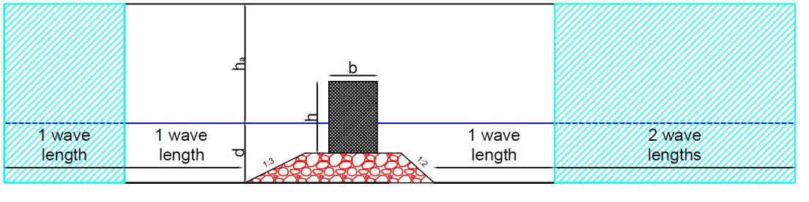

Sliding caisson breakwater
==========================

Here is a modelling of the dynamic response of a vertically composite caisson
breakwater subject to breaking wave loads that are able to permanently displace it from its resting position.
The test case aims to assess the ability of Proteus to model motion response of the superstructure to wave
loadings. Sliding and overturning of the caisson superstructure were modelled and its dynamic response
compared with experimental data from Wang et al. (2006).

A numerical tank was set-up, housing a vertically composite caisson breakwater (see Figure),
having the following dimensions and properties:

* Caisson length equal to 0.300 m, height equal to 0.385 m, width equal to 0.400 m and mass equal to 64.8 kg.
* Rubble mound length equal to 0.785 m, height equal to 0.175 m, seaward and shoreward slopes equal to
1/3 and 1/2, respectively, n=0.4 , d50=0.050m and d15=d50/1.2;

In order to run 2D simulations, all the physical parameters and variables were normalised per unit length.

References
----------
Wang Yuan-Zhan, Chen Nan-Nan and Chi Li-Hua (2006). Numerical simulation on joint motion processes of
various modes of caisson breakwater under wave excitation. Communications in Numerical Methods in
Engineering 22, 535-545.
