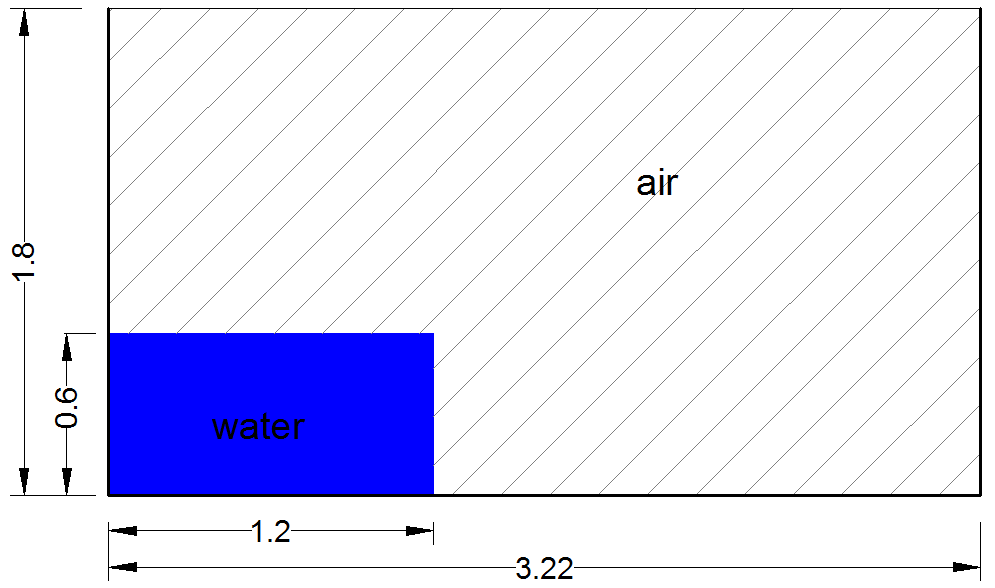

Dambreak flow - Collagrosi and Landrini benchmark
===================

The problem consists of a 0.60m x 1.20m (height x width) column of
water, initially at rest, that collapses under the action of gravity
and impacts to a wall.  The computational domain is a rectangular box
with a heigth of 1.80m and a width of 3.22m.  The top of the domain is
left open, when the rest of the boundary patches act as no slip walls.
In the following figure, a sketch of the dambreak initial conditions
is shown.

This case tests the ability of PROTEUS to simulate the free-surface
evolution and forces / pressures on structures, according to data that
are available in the following references.  For more details, see
runfiles or references.

References
----------

- Colagrossi A and Landrini M (2003) Numerical simulation of
  interfacial flows by smoothed particle hydrodynamics, Journal of
  Computational Physics,191,448-475.

- Martin, J. C. & Moyce, W. J., (1952) Part IV. An Experimental Study
  of the Collapse of Liquid Columns on a Rigid Horizontal Plane
  Phil. Trans. R. Soc. Lond. A 244 (882) 312-324.

- Zhou, Z. Q., De Kat, J. O. and Buchner, B. (1999) A nonlinear 3-D
  approach to simulate green water dynamics on deck in: J. Piquet
  (Ed.), Proc. 7th Int. Conf. Num. Ship Hydrod., Nantes, 5.11, 15.
