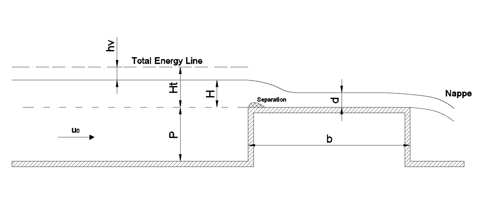

Broad crested weir
==================

A broad-crested weir is a standard hydraulic structure used as discharge measuring device and flow control device in open channel. A simple sketch of the structure is presented in the figure ?below, showing the main parameters involved:

In HR Wallingford (2015), the flow past a broad-crested weir was modelled using PROTEUS and recommendations were made for  the optimisation of the numerical parameters, the aeration of the flow behind the nappe through appropriate boundary conditions and the use of relaxation zone for absorbing any boundary instabilities developing at the inlet and the outlet. Herein, the optimal, so far, configuration of the broad-crested weir case is presented.

