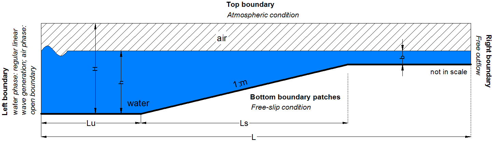

Linear wave shoaling
====================

Sea waves transform when propagating from the offshore to the near
shore environment and as they interact with coastal structures. In a
2D flume, the main factors contributing to wave transformation are
shoaling, reflection, transmission and breaking. The present case
consists of a numerical experiment aiming to reproduce regular linear
wave shoaling over simple but realistic bathymetry of a constant-slope
beach.  The assessment of the numerical model performance is achieved
through comparison with theoretical solutions.

The present problem consists of a 2D numerical flume with a sloping
bottom with 1:m slope. Upstream the slope there is a flat bottom
region with length, Lu, equal to 5.0 m, the domain height, H, is 1.5 m
and the mean water depth, h, is equal to 1.0 m. Downstream of the
slope the water depth,b , is 0.4 m. The total length of the domain, L,
is 30m. Two cases with slopes 1:10 and 1:25 are tested, where the
length of the slope, Ls, is 6.0 m and 15.0 m respectively. Case A
corresponds to the slope 1:10 and case B corresponds to the slope
1:25. In both cases, at the left boundary regular linear waves are
generated with height of 0.025 m and period of 1.94 s. The bottom
boundaries act as a no-slip walls. A sketch of the domain is given in
the following figure.

This test case demonstrates the ability of PROTEUS to simulate the
shoaling process of regular linear waves over a constant slope
bathymetries as well as their absorption.

References
----------

- US Army Corps of Engineer (2002) Coastal Engineering
  Manual. Engineer Manual 1110-2-1100, US Army Corps of Engineers,
  Washington, DC (in 6 volumes)

