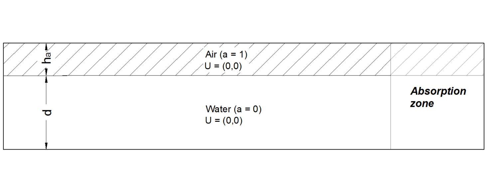

Linear wave propagation
=======================

To consider a wave linear, its free-surface steepness must be low (~ 0.1%).
Free surface steepness depends on the global wave steepness, H/lambda, where H is the
wave height and lambda is the wave length, and the shape of the wave, which deviates
from sinusoidal shape as the wave propagates in shallow water. The relation between
the wavelength and the water depth is expressed with the linear dispersion equation,
which is valid for linear and weakly nonlinear waves.

.. math::
   \lambda = \frac{gT^2}{2\pi}tanh\left(2\pi\frac{\lambda}{d}\right)	

Where T is the wave period, lamdba is the wavelength, d is the water depth and g is
the gravitational acceleration. According to this equation, for a given wave period,
the wavelength will be a function of the water depth.

Plane regular linear waves are generated and absorbed in a 2D numerical tank using 
PROTEUS.  Waves are generated at the inlet and they are either absorbed at the outlet 
(passive absorption) or allowed to reflect back to the generation zone and absorbed 
there (active absorption). The performance of the model is investigated in terms of 
wave generation accuracy and active and passive absorption efficiency.

The numerical tank consists of a 2D rectangular box as shown in figure. The origin of
the system of coordinates used to build the geometry is located at the 
left bottom corner of the domain.

