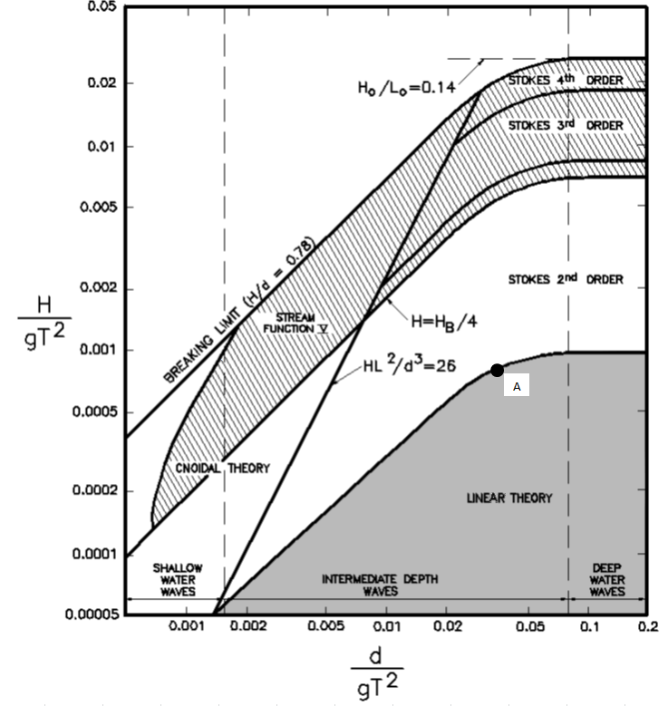

Linear wave propagation and absorption
======================================

Water waves with low steepness are considered linear (:math:`H/L` < 0.1%, where :math:`H` is the wave height and :math:`L` is the wavelength). This means that the form of the waves is sinusoidal and high order terms are negligible. The wavelength, wave period and water depth are interdependent through the linear dispersion relation. In terms of classification in the Lé Méhauté (1976) diagram, linear waves are located at the lower right part (see below)

The present problem comprises of a 1.5m x 30.0m (height x length) numerical flume with 
a flat bottom and still water depth equal to 1.0m. At the left boundary, linear 
waves are generated with a height of 0.025m and a period of 1.94s. There is a 5m 
generation zone on the left side and a 10m absorption zone on the right.

This case tests demonstrates the ability of Proteus to simulate the generation, propagation
and absorption of of linear water waves.

The python test file named ``test_linearWaves.py`` is made up of three tests:

* The first test checks that the run is completed successfully.
* The second test is to validate the results comparing them to the theory. For this case we will compare the numerical and theoretical wave height in the middle of the tank. The wave height is calculated using pressure probes results combined with linear theory predictions
* The third test evaluates wave reflection and compares to a threshold. The calculation of reflection is performed by applying Isaacson's 3rd method (Isaacson 1991) to the primary harmonic of the signal.
One can run this test file typing ``py.test --boxed test_linearWaves.py``.

References
----------

- US Army Corps of Engineer (2002) Coastal Engineering Manual. Engineer Manual 
1110-2-1100, US Army Corps of Engineers, Washington, DC (in 6 volumes)

- Lé Méhauté, B., (1976). “Introduction to Hydrodynamics and water waves”, 
Springer-Verlag, New York.

- Isaacson (1991), Measurement of regular wave reflection, Journal of Waterway Port Coastal and Ocean Engineering 117(6), 553-569

