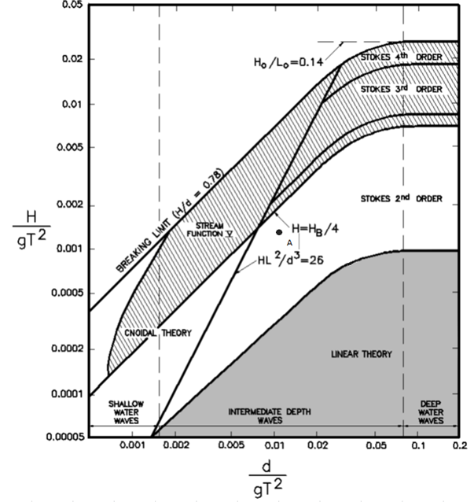

Nonlinear wave generation/absorption
====================================

Plane regular nonlinear waves are mild and high steepness waves that 
propagate in a single direction, in uniform wave fronts.  The wave 
profile deviates from the sinusoidal shape, and it typically exhibits 
high and sharp wave crests and low and flat wave troughs.  We cannot 
always accurately calculate the wave celerity from the linear 
dispersion theory, especially for highly nonlinear waves. 
Fenton (1988) proposes a method for calculating the nonlinear wave 
properties and profile, which we have adopted for the generation of 
nonlinear waves within Proteus. 

Given the wave period, the wavelength will be a function of the water 
depth. So it is the wave period, water depth and the wave height that 
contribute to the linearity or nonlinearity of the wave. Their 
interrelation is summarised in the following figure (Lé Méhauté 1976). 

where, the vertical axis corresponds to the no dimensional wave height 
and the horizontal to the no dimensional water depth. The term gT\ 
:sup:`2`\ is proportional to the wavelength in deep water and the dot 
named A corresponds to the tested case which is described below.  The 
present problem consists of 2D rectangular numerical flume with height 
of 0.7 m and a length of 31.48 m, where the mean water depth is equal 
to 0.4 m. At the left boundary, a regular non-linear wave is 
generated with a height of 0.05 m and a period of 2.0 s using 
Fenton's method (Fenton, 1988). In the top boundary atmospheric 
conditions have been assigned and the bottom boundaty acts as a 
free-slip wall. 

This case tests demonstrates the ability of PROTEUS to simulate the 
generation and propagation of non-linear waves as well as their 
absorption. 

The python test file named ``test_nonlinearWaves.py`` is made up of three tests:

* The first one is to know if the case can run.
* The second test is to validate the results comparing them to the theory. For this case we will compare the numerical and theoretical wave height in the middle of the tank.
* The third one is to test the reflection. 
One can run this test file typing ``py.test --boxed test_nonlinearWaves.py``.

References
----------

- Fenton JD (1988) The numerical solution of steady water wave 
  problems, Comp and Geosc, 14(3), 357-368.

