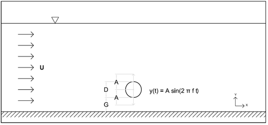

OSCILLATING CYLINDER 
===================

Description
-----------
  
Predicting oscillatory motion in submerged pipelines is a key application in fluid/structure interaction and a
challenging problem to address with computacional and physical modelling due to the complexity of the processes
involved in coupling highly turbulent flows with the pipeline motion. The experimental data used are whose found 
in Fu et al., (2014)
 
According this experimental configuration, a cylinder with diameter D=0.25 was placed in a 196 m long, 10m wide 
and 4.2m deep towing tank. In the laboratory tests a 2.5m long, 2.4m wide and 0.003m thick steel plate was placed
near the bottom of the flume. The plate could be adjusted to different levels in order to mimic different gap 
heights from the seabed. The cylinder and the plate were towed with a speed of 0.8m/s and a mechanical vertical
oscillatory motion was forced. The scope of the experiment was to explore the interaction of vortex shedding in
different vertical motion periods that could represent i.e. wave-induced motion.
 
Proteus is used to simulate this experiment. In the next figure a croquis of the situation is shown.
 

 
References 
----------
* Fu S, Xu Y; and Chen Y (2014), Seabed Effects on the Hydrodinamics of a Circular Cylinder Undergoing 
  Vortex-Induced Vibration at High Reynolds Number, Journal of Waterway, Port, Coastal and Ocean 
  Engineering-ASCE, 140, 04014008
