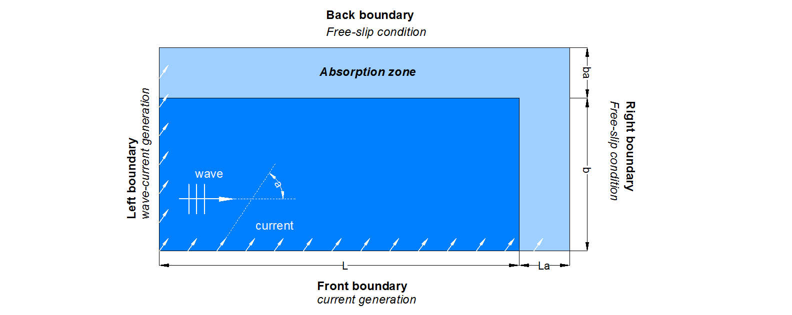

Directional wave/current interaction benchmark case
======================================================

The presence of a current in the wave field causes the waves to transform. The primary effect of a current to 
a wave is the change of the wavelength due to a Doppler shift. The effect of the current on the transformation of 
the waves depends on the angle between the current’s direction and the direction of the propagation of the waves, a. 

If the angle a is less than 90° (current with a following component) the wavelength is increased over the one that waves would 
possess in still water. If the angle a is greater than 90° (current with an opposing component) then the wavelength is decreased. 
Finally, in the case that a is equal to 90°, then the wave characteristics are not modified due to the presence of the current. 

Wave current interaction with the waves, also, affects the wave height due to wave energy conservation and the wave height decreases 
for following currents and increases for opposing currents. Given the wave period, modified height, 
depth and current velocity, the Fenton Fourier Transform theory (Fenton, 1988) can be used to calculate wavelength, particle velocities 
and pressure.

The case is simulated using a 3D rectangular numerical domain with height of 1.5 m, a length, (L + La), and width, (b + ba). The mean water 
depth in the domain is equal to 1.0 m. Within the left boundary (wave maker) interacted waves with a current are generated imposing the flux 
parameters according to Fenton’s method. In the front boundary a uniform current profile is imposed in the region below the still water level. 
Free-slip boundary conditions are assigned to the bottom boundary. The top boundary has been assigned atmospheric conditions and the right 
boundary, as well as the back boundary, has been assigned outflow conditions. 

A sketch of the plan of the 3D domain is shown in the following figure.

where, 

* L - the effective length of the numerical basin 
* La - the length of the Absorption zone in the x direction
* b - the effective width of the numerical basin
* ba - the length of the Absorption zone in the y direction
       
This test case demonstrates the ability of PROTEUS to simulate the directional interaction between waves and current, as well as the wave 
absorption within a 3D domain configuration.

References
--------------------------------

- Fenton JD (1988) The numerical solution of steady water wave problems. Computer and Geosciences,14(3), 357-368.

- Kenyon K (1971) Wave Refraction in Ocean Currents Deep Sea Research, 18, 1023–1034.

