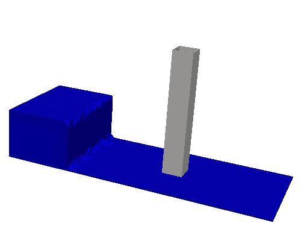

Dambreak flow with tall obstacle - Gomez-Gesteira and Dalrymple (2004)
======================================================================

The the domain is initialised with a 0.4m x 0.3m x 0.61 (dx x dz x dy) column of
water, initially at rest.  Under the action of gravity, the water
column collapses and interacts with an obstacle.  The
computational domain is a 3D rectangular box with dimensions 1.6m long
x 0.61m x 0.75m high.  The obstacle has dimensions 0.12m x 0.12m, it
is placed on the tank' s bottom and reaches the top of the domain.
The top of the domain acts as an atmosphere boundary, while the remaining boundaries
act as no slip walls.  In the following figure, a sketch of
the dambreak initial conditions is shown.

This case tests the ability of PROTEUS to simulate the free-surface
evolution and forces / pressures on structures. The results of the
simulations can be compared with the data in the following references.
For more details, see casefiles or references.

References
----------

- Gómez-Gesteira, M. and R.A. Dalrymple, "Using a 3D SPH Method for
  Wave Impact on a Tall Structure, J. Waterway, Port, Coastal, Ocean
  Engineering, 130(2), 63-69, 2004.

