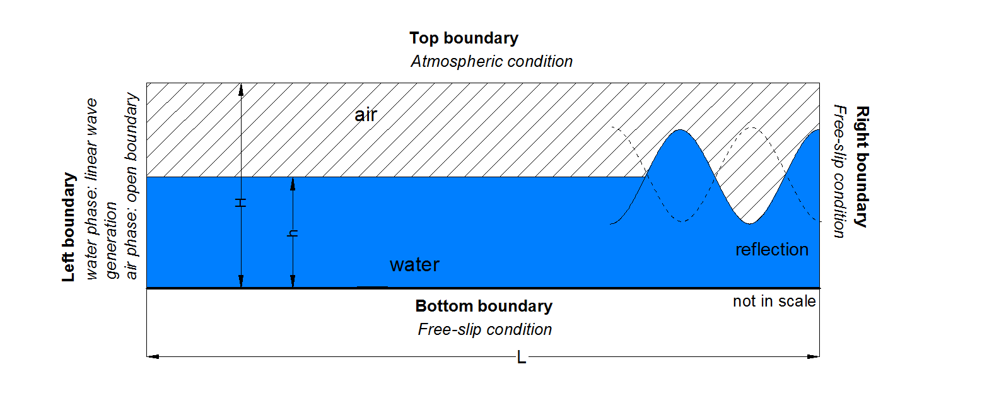

Wave reflection  benchmark case
===============================================================

The present case tests the reflection of linear waves to a wall vertical solid wall.
The numerical domain of the simulation consists of a 2D rectangular flume with a height, H, of 2.0 m and a length, L, of 10.0 m, where the mean water depth, h, is equal to 1.0 m. At the left boundary, linear regular waves are generated with a height of 0.025 m and a period of 1.94 s, imposing appropriately the flux parameters. Atmospheric conditions have been assigned to the top boundary of the domain and the bottom boundary act as a free-slip wall. The right boundary represents the vertical solid wall and therefore free-slip condition have been assigned to it.
A sketch of the domain is given in the following figure.

 
This test case demonstrates the ability of PROTEUS to simulate the reflection of linear waves.

References
--------------------------------

- Goda Y (2009) Random seas and design of maritime structures, 3rd edition, World Scientific, Singapore

